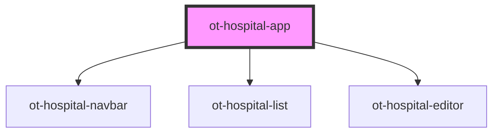

# ot-hospital-app

<!-- Auto Generated Below -->

## Properties

| Property     | Attribute     | Description | Type     | Default     |
| ------------ | ------------- | ----------- | -------- | ----------- |
| `apiBase`    | `api-base`    |             | `string` | `undefined` |
| `basePath`   | `base-path`   |             | `string` | `""`        |
| `hospitalId` | `hospital-id` |             | `string` | `undefined` |

## Dependencies

### Depends on

- [ot-hospital-navbar](../ot-hospital-navbar)
- [ot-hospital-list](../ot-hospital-list)
- [ot-hospital-editor](../ot-hospital-editor)

### Graph

----------------------------------------------

*Built with [StencilJS](https://stenciljs.com/)*
