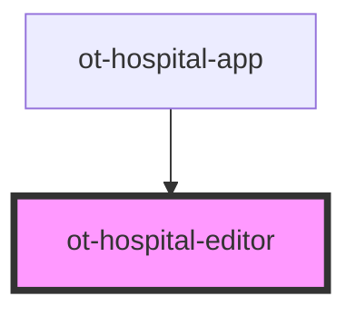

# ot-hospital-editor

<!-- Auto Generated Below -->

## Properties

| Property     | Attribute     | Description | Type     | Default     |
| ------------ | ------------- | ----------- | -------- | ----------- |
| `apiBase`    | `api-base`    |             | `string` | `undefined` |
| `entryId`    | `entry-id`    |             | `string` | `undefined` |
| `hospitalId` | `hospital-id` |             | `string` | `undefined` |

## Events

| Event           | Description | Type                  |
| --------------- | ----------- | --------------------- |
| `editor-closed` |             | `CustomEvent<string>` |

## Dependencies

### Used by

 - [ot-hospital-app](../ot-hospital-app)

### Graph

----------------------------------------------

*Built with [StencilJS](https://stenciljs.com/)*
