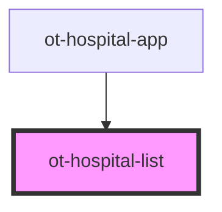

# ot-hospital-list

<!-- Auto Generated Below -->

## Properties

| Property                  | Attribute     | Description | Type     | Default     |
| ------------------------- | ------------- | ----------- | -------- | ----------- |
| `apiBase`                 | `api-base`    |             | `string` | `undefined` |
| `hospitalId` _(required)_ | `hospital-id` |             | `string` | `undefined` |

## Events

| Event           | Description | Type                  |
| --------------- | ----------- | --------------------- |
| `entry-clicked` |             | `CustomEvent<string>` |

## Methods

### `reload() => Promise<void>`

#### Returns

Type: `Promise<void>`

## Dependencies

### Used by

 - [ot-hospital-app](../ot-hospital-app)

### Graph

----------------------------------------------

*Built with [StencilJS](https://stenciljs.com/)*
