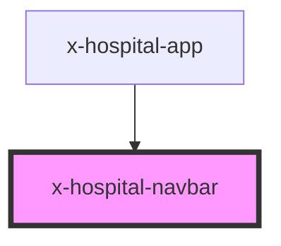

# x-hospital-navbar

<!-- Auto Generated Below -->

## Properties

| Property                  | Attribute     | Description | Type     | Default             |
| ------------------------- | ------------- | ----------- | -------- | ------------------- |
| `apiBase` _(required)_    | `api-base`    |             | `string` | `undefined`         |
| `basePath`                | `base-path`   |             | `string` | `'/employee-list/'` |
| `hospitalId` _(required)_ | `hospital-id` |             | `string` | `undefined`         |

## Dependencies

### Used by

 - [x-hospital-app](../x-hospital-app)

### Graph

----------------------------------------------

*Built with [StencilJS](https://stenciljs.com/)*
